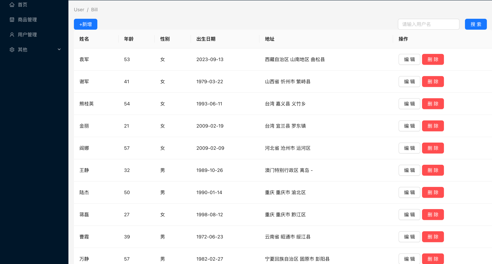

## 一、动态配置路由
配置文件如下
```
export default  [
    {
        path: '/home',
        name: 'home',
        label: '首页',
        icon: 'HomeOutlined',
        url: '/home/index'
    },
    {
        path: '/mall',
        name: 'mall',
        label: '商品管理',
        icon: 'ShopOutlined',
        url: '/mall/index'
    },
    {
        path: '/user',
        name: 'user',
        label: '用户管理',
        icon: 'UserOutlined',
        url: '/user/index'
    },
    {
        path: '/other',
        label: '其他',
        icon: 'SettingOutlined',
        children: [
        {
            path: '/other/pageOne',
            name: 'page1',
            label: '页面1',
            icon: 'SettingOutlined'
        },
        {
            path: '/other/pageTwo',
            name: 'page2',
            label: '页面2',
            icon: 'SettingOutlined'
        }
        ]
    }
]
```

获取路由配置，来源后端接口返回
```
import MenuConfig from '../../config'
const iconnameToElement = ((iconname) => React.createElement(Icon[iconname]))
const items = MenuConfig.map((item) => {
  // 没有子菜单
  const child = {
    key: item.key,
    label: item.label,
    icon: iconnameToElement(item.icon)
  }
  // 有子菜单就在chidren属性内部 map return
  if (item.children) {
    child.children = item.children.map((item) => {
      return {
        key: item.key,
        label: item.label
      }
    })
  }
  // 合并return child
  return child
})
```


## 下拉菜单
<Dropdown menu={{items}}> 
这里注意是{{}}
因为获取const变量也需要{}

## 三、redux store reducers
如何安装
```
npm install @reduxjs/toolkit react-redux
```
```
import { useDispatch } from 'react-redux';
import {collapseMenu} from '../../store/reducers/tab'

  // 创建dispatch
  const dispatch = useDispatch()
  // 点击展开收起按钮回调
  const setCollapsed = () => {
    console.log('CommonHeader中点击按钮后',collapsed)
    dispatch(collapseMenu())
  }
```
  这里为什么要多余创建一个dispatch


  (0 , _store_reducers_tab__WEBPACK_IMPORTED_MODULE_2__.collapseMenu) is not a function TypeError: (0 , _store_reducers_tab__WEBPACK_IMPORTED_MODULE_2__.collapseMenu) is not a function

  这里需要把reducer/tab.js中reducer改为reducers
  ```
  import { createSlice } from "@reduxjs/toolkit";

const tabSlice = createSlice({
    name: 'tab',
    initialState: {
        isCollapse: false
    },
    reducers: {
        collapseMenu: state => {
            state.isCollapse = !state.isCollapse
        }
    }
})

export const {collapseMenu} = tabSlice.actions
export default tabSlice.reducer
  ```

## 四、axios二次封装
https://axios-http.com/docs/interceptors

## Mock.js
Mock.mock()
3个参数
rurl
rtype
template

## 自适应 栅格 flex

## Echarts
```
// 组装MyEcharts组件所需数据
      // x轴数据
      const xData = orderData.date
      // series数据
      const keyArray = Object.keys(orderData.data[0])
      const series = []
      keyArray.forEach(key => {
        series.push({
          name: key,
          data: orderData.data.map(item => item[key]),
          type: 'line' // 折线图
        })
      })
      setEchartData({
        // 折线图
        order: {
          xData: xData,
          series: series
        },
        // 柱状图
        user: {
          xData: userData.map(item => item.date),
          series: [
            {
              name: '新增用户',
              data: userData.map(item => item.new),
              type: 'bar'
            },
            {
              name: '活跃用户',
              data: userData.map(item => item.active),
              type: 'bar'
            }
          ]
        },
        // 饼图
        video: {
          series: {
            data: videoData,
            type: 'pie'
          }
        }
      })
```
const [tableData, setTableData] = useState([]) // 如果这里不初始化为数组, table的datasource 会报错rawData.some is not a function



          <Form.Item
            label="年龄"
            name='age'
            rules={[
                // 细节：这里必须用列表[]包裹rules
              {
                require: true,
                message: '请输入年龄'
              },
              {
                type: 'number',
                message: '年龄必须为数字'
              }
            ]}
          >
            <InputNumber placeholder='请输入年龄'></InputNumber>
          </Form.Item>

const form = Form.useForm()  报错Cannot set properties of undefined (setting 'name')
在 React 中，const [form] = Form.useForm() 这一行代码使用了数组解构赋值的语法特性。这里的 [] 并不是直接与 Form.useForm() 函数调用相关联，而是用于从 Form.useForm() 返回的结果中提取特定值的一种方式。具体来说，Form.useForm() 方法返回的是一个数组，这个数组的第一个元素是一个 FormInstance 对象，它提供了许多用于操作表单的方法和属性5。

## dayjs 日期转换


数据回填
```
const handleClick = (type, rowData) => {
    setIsModalOpen(!isModalOpen)
    console.log('rowData', rowData)
    if (type === 'add') {
      setModalType(0) // 新增
    } else {
      setModalType(1) // 编辑
      // 数据回显
      // 深拷贝
      const cloneData = JSON.parse(JSON.stringify(rowData))
      cloneData.birth = dayjs(cloneData.birth)
      form.setFieldsValue(cloneData) // key和name一定要对应, 区分于setFieldValue
    }
  }


删除按钮带一个确认弹窗
```
<Popconfirm
  title='提示'
  description='此操作将删除该用户,是否继续?'
  okText='确认'
  cancelText='取消'
  onConfirm={() => handleDelete(rowData)}
// onCancel={}
>
  <Button type="primary" danger>删除</Button>
</Popconfirm>
```